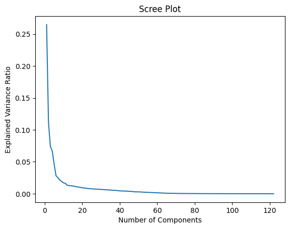
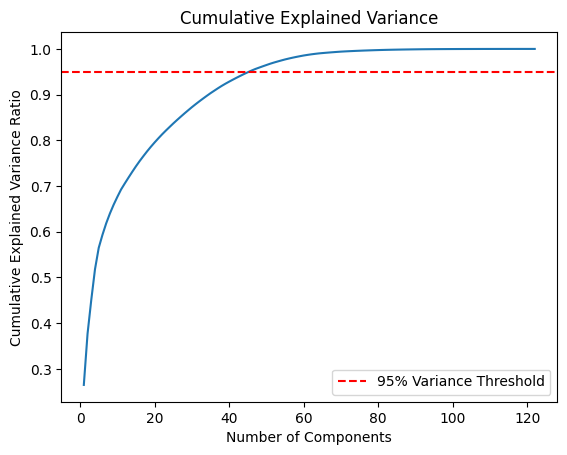
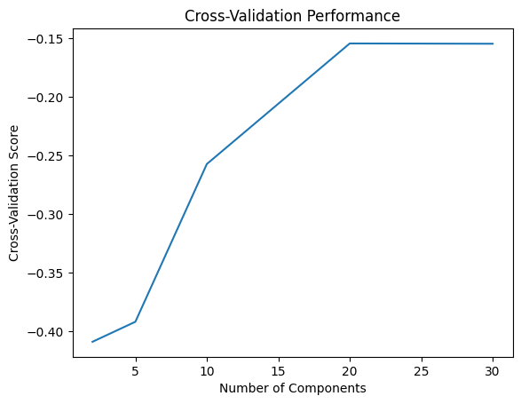
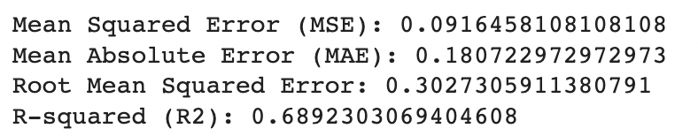

<p> </p> 

## **Hackathon A: tick occurrences GB** 


**Mehtab Alam Syed**


**MOOD Summer School 2023**

---
  
## Install package to read rds
  
```sh
 !pip install pyreadr 
 ```
  
Step 1: Scaling covariates
  
# Number of Features to be selected for Prediction using Scree Plot


A scree plot shows the eigenvalues on the y-axis and the number of factors on the x-axis. It always displays a downward curve. The point where the slope of the curve is clearly leveling off (the “elbow) indicates the number of factors that should be generated by the analysis.


  
# Cumulative Explained Variance 

The explained variance ratio is the percentage of variance that is attributed by each of the selected components. Ideally, you would choose the number of components to include in your model by adding the explained variance ratio of each component until you reach a total of around 0.8 or 80% to avoid overfitting.


  
  
# Cross Validation Approach

Cross-Validation: Another approach is to use cross-validation techniques, such as k-fold cross-validation, to evaluate the performance of the model with different numbers of components. You can compare the model's performance metrics (e.g., accuracy, RMSE) for different numbers of components and choose the number that provides the best trade-off between model performance and complexity.
  


# Applyed PCA on scaled dataframe  

 I chose the optimal PCA components after reducing covariates = 15.
  
```python
pca = PCA(n_components=15)  # Specify the number of components to keep
reduced_features = pca.fit_transform(scaled_df)


scaler = MinMaxScaler()
scaled_pca_components = scaler.fit_transform(reduced_features)


labels = ['PC1','PC2', 'PC3','PC4','PC5','PC6','PC7','PC8','PC9','PC10','PC11','PC12','PC13','PC14','PC15']
reduced_df = pd.DataFrame(data=scaled_pca_components, columns=labels)


reduced_df['Ticks'] = target
  
  

final_scaled_df = pd.concat([non_numerical_df, gis_df, reduced_df], axis=1)
final_scaled_df  
```
# Applied Random Forest Regressor to predict values
```python
  
from sklearn.model_selection import train_test_split
from sklearn.ensemble import RandomForestRegressor
from sklearn.metrics import mean_squared_error, mean_absolute_error, r2_score


#data_df.drop('Time_step', axis=1, inplace=True)


X = data_df.loc[:, data_df.columns!='Ticks']
y = data_df.Ticks

X_train, X_test, y_train, y_test = train_test_split(X, y, test_size=0.2, random_state=42)

model = RandomForestRegressor(n_estimators=100, random_state=42)

#cv_scores = cross_val_score(model, X, y, cv=5)


# Print the cross-validation scores
#print("Cross-validation scores:", cv_scores)

# Calculate and print the mean accuracy
#mean_accuracy = cv_scores.mean()
#print("Mean Accuracy:", mean_accuracy)

#model.fit(X, y)

# Applying Random Forest Regressor 

model.fit(X_train, y_train)

y_test_pred = model.predict(X_test)

# Calculate evaluation metrics
mse = mean_squared_error(y_test, y_test_pred)
mae = mean_absolute_error(y_test, y_test_pred)
r2 = r2_score(y_test, y_test_pred)
rmse = np.sqrt(mse)
print("Mean Squared Error (MSE):", mse)
print("Mean Absolute Error (MAE):", mae)
print("Root Mean Squared Error:", rmse)
print("R-squared (R2):", r2)


y_test
  
```  
# Results with training data
  

  
